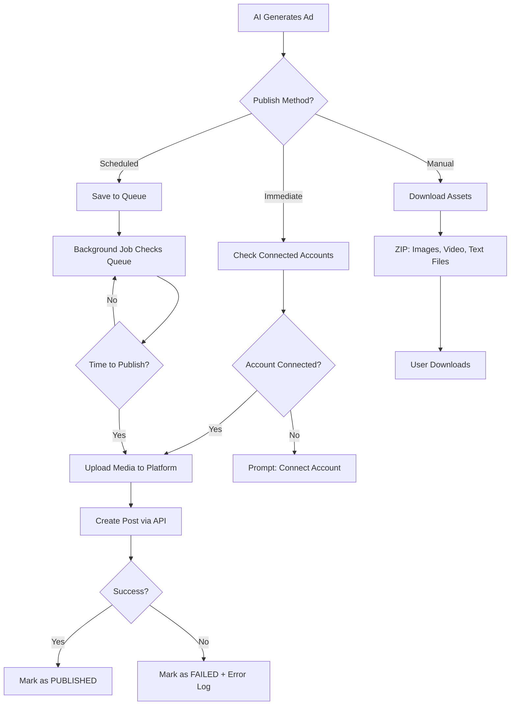

# 🚀 Social Media Publishing Sistema

## Kaip Sistema Postina Reklamą

Sistema palaiko **dviejų tipų publikavimą**:

### 1. **Automatinis Publikavimas** (Direct Posting)
Sistema **tiesiogiai** postina į platformas naudojant jų API.

### 2. **Planinė Publikacija** (Scheduled Posting)
Sistema **išsaugo** turinį ir publikuoja nustatytu laiku.

---

## 🔌 Platformų Integracijos

### **Meta Platforms** (Facebook & Instagram)

#### Setup:
1. Sukurti **Meta Business Suite** paskyrą
2. Gauti **Facebook Graph API** access token
3. Prijungti Instagram Business paskyrą

#### API Endpoints:
```typescript
// Facebook Post
POST https://graph.facebook.com/v18.0/{page-id}/feed
{
  "message": "Ad copy here...",
  "link": "https://example.com",
  "access_token": "{token}"
}

// Instagram Post (Image)
POST https://graph.facebook.com/v18.0/{instagram-account-id}/media
{
  "image_url": "https://example.com/image.jpg",
  "caption": "Ad copy with #hashtags",
  "access_token": "{token}"
}

// Instagram Reels
POST https://graph.facebook.com/v18.0/{instagram-account-id}/media
{
  "media_type": "REELS",
  "video_url": "https://example.com/video.mp4",
  "caption": "Reels caption",
  "access_token": "{token}"
}
```

#### Funkcionalumas:
- ✅ Image Posts (1080x1080)
- ✅ Video Posts (Reels 9:16)
- ✅ Carousel Posts (iki 10 nuotraukų)
- ✅ Stories (24h)
- ✅ Scheduled Posts
- ✅ Analytics tracking

---

### **TikTok for Business**

#### Setup:
1. Registruotis **TikTok for Business**
2. Gauti **Content Posting API** prieigą
3. Autorizuoti paskyrą

#### API Endpoint:
```typescript
POST https://open-api.tiktok.com/share/video/upload/
{
  "open_id": "{user_id}",
  "access_token": "{token}",
  "video": {
    "video_url": "https://example.com/video.mp4",
    "caption": "Caption with #hashtags",
    "privacy_level": "PUBLIC_TO_EVERYONE",
    "disable_duet": false,
    "disable_comment": false,
    "disable_stitch": false
  }
}
```

#### Funkcionalumas:
- ✅ Video Posts (9:16, max 3 min)
- ✅ Caption + Hashtags
- ✅ Scheduled Publishing
- ✅ Sound/Music selection
- ✅ Analytics

---

### **Google Ads**

#### Setup:
1. Sukurti **Google Ads** paskyrą
2. Gauti **Google Ads API** credentials
3. Setup billing

#### API:
```typescript
// Create Display Ad
POST https://googleads.googleapis.com/v15/customers/{customer-id}/campaigns
{
  "campaign": {
    "name": "AI Generated Campaign",
    "advertising_channel_type": "DISPLAY",
    "targeting": {...},
    "bidding_strategy": "MAXIMIZE_CONVERSIONS"
  },
  "ad_group": {
    "name": "Product Ad Group",
    "ads": [{
      "display_ad": {
        "marketing_images": [...],
        "headlines": [...],
        "descriptions": [...],
        "business_name": "Your Brand"
      }
    }]
  }
}
```

---

## 🔐 Vartotojo Paskyros Prijungimas

### **OAuth Flow:**

1. **Vartotojas spaudžia "Prijungti Instagram"**
2. Nukreipiamas į Meta OAuth:
   ```
   https://www.facebook.com/v18.0/dialog/oauth?
     client_id={app-id}&
     redirect_uri={redirect-uri}&
     scope=instagram_basic,instagram_content_publish,pages_read_engagement
   ```
3. Vartotojas autorizuoja
4. Sistema gauna `access_token`
5. Token išsaugomas DB užšifruotas

### **Prisijungusios Paskyros:**
```typescript
interface ConnectedAccount {
  id: string;
  userId: string;
  platform: 'INSTAGRAM' | 'FACEBOOK' | 'TIKTOK' | 'GOOGLE_ADS';
  accountId: string;
  accountName: string;
  accessToken: string; // encrypted
  refreshToken: string; // encrypted
  expiresAt: Date;
  status: 'ACTIVE' | 'EXPIRED' | 'DISCONNECTED';
  permissions: string[];
}
```

---

## 📤 Publikavimo Procesas

### **1. Vartotojas Sugeneruoja Reklamą:**
```typescript
// Generate ad
const ad = await generateAd({
  productName: "iPhone 15 Pro",
  adType: "VIDEO",
  platform: "INSTAGRAM"
});

// Ad saved to database with status: DRAFT
```

### **2. Pasirinkimas Kaip Publikuoti:**

#### **Opija A: Publikuoti Dabar**
```typescript
await publishAd(adId, {
  method: 'IMMEDIATE',
  accounts: ['instagram_123', 'facebook_456']
});
```

#### **Opcija B: Suplanuoti Publikaciją**
```typescript
await scheduleAd(adId, {
  scheduledAt: '2026-01-15 14:00',
  accounts: ['instagram_123'],
  timezone: 'Europe/Vilnius'
});
```

#### **Opcija C: Atsisiųsti & Publikuoti Rankiniu Būdu**
```typescript
await downloadAdAssets(adId);
// Downloads: video.mp4, caption.txt, hashtags.txt
```

---

## 🔄 Publikavimo Workflow



---

## 💾 Database Schema

### **Published Ads Table:**
```sql
CREATE TABLE published_ads (
  id UUID PRIMARY KEY,
  ad_id UUID REFERENCES ads(id),
  user_id UUID REFERENCES users(id),
  platform VARCHAR(50), -- INSTAGRAM, FACEBOOK, etc.
  account_id VARCHAR(255), -- Connected account ID
  
  -- Publishing details
  status VARCHAR(50), -- QUEUED, PUBLISHING, PUBLISHED, FAILED
  method VARCHAR(50), -- IMMEDIATE, SCHEDULED
  scheduled_at TIMESTAMP,
  published_at TIMESTAMP,
  
  -- Platform response
  platform_post_id VARCHAR(255), -- Platform's post ID
  platform_url VARCHAR(500), -- Link to published post
  platform_response JSONB, -- Full API response
  
  -- Performance
  views INT DEFAULT 0,
  likes INT DEFAULT 0,
  comments INT DEFAULT 0,
  shares INT DEFAULT 0,
  clicks INT DEFAULT 0,
  
  error_message TEXT,
  created_at TIMESTAMP DEFAULT NOW(),
  updated_at TIMESTAMP DEFAULT NOW()
);
```

---

## 🎯 Publishing API Endpoints

### **1. Prijungti Socialinę Paskyrą**
```typescript
POST /api/social/connect
{
  "platform": "INSTAGRAM",
  "redirectUri": "https://app.sanyla.com/callback"
}
Response: { authUrl: "https://oauth..." }
```

### **2. Publikuoti Dabar**
```typescript
POST /api/ads/{adId}/publish
{
  "accounts": ["instagram_123"],
  "method": "IMMEDIATE"
}
Response: {
  "success": true,
  "published": [{
    "platform": "INSTAGRAM",
    "postUrl": "https://instagram.com/p/ABC123",
    "postId": "18123456789"
  }]
}
```

### **3. Suplanuoti Publikaciją**
```typescript
POST /api/ads/{adId}/schedule
{
  "accounts": ["instagram_123", "tiktok_456"],
  "scheduledAt": "2026-01-15T14:00:00Z",
  "timezone": "Europe/Vilnius"
}
```

### **4. Gauti Publikacijos Statusą**
```typescript
GET /api/ads/{adId}/publish-status
Response: {
  "status": "PUBLISHED",
  "platforms": [{
    "platform": "INSTAGRAM",
    "publishedAt": "2026-01-10T10:30:00Z",
    "postUrl": "https://instagram.com/p/ABC",
    "analytics": {
      "views": 1523,
      "likes": 234,
      "comments": 45
    }
  }]
}
```

---

## 📊 Analytics Tracking

Sistema automatiškai seka kiekvieną publikaciją:

```typescript
// Webhook from Meta API
POST /api/webhooks/meta
{
  "entry": [{
    "changes": [{
      "field": "insights",
      "value": {
        "post_id": "123",
        "metric": "impressions",
        "value": 1523
      }
    }]
  }]
}
```

Atnaujina DB:
```sql
UPDATE published_ads 
SET views = 1523, 
    likes = 234,
    updated_at = NOW()
WHERE platform_post_id = '123';
```

---

## 🔒 Saugumo Priemonės

### **1. Token Encryption:**
```typescript
import { encrypt, decrypt } from '@/lib/crypto';

const encryptedToken = encrypt(accessToken, process.env.ENCRYPTION_KEY);
// Save to DB

const decryptedToken = decrypt(encryptedToken, process.env.ENCRYPTION_KEY);
// Use for API calls
```

### **2. Token Refresh:**
```typescript
// Auto-refresh expired tokens
if (account.expiresAt < new Date()) {
  const newToken = await refreshAccessToken(account.refreshToken);
  await updateAccountToken(account.id, newToken);
}
```

### **3. Rate Limiting:**
```typescript
// Prevent API abuse
const rateLimit = {
  INSTAGRAM: { posts: 25, period: '24h' },
  TIKTOK: { posts: 5, period: '1h' },
  FACEBOOK: { posts: 50, period: '24h' }
};
```

---

## 🚀 Būsimos Funkcijos

- [ ] **Instagram Shopping Tags** - produktų žymėjimas
- [ ] **Auto-Hashtag Optimization** - AI randa geriausius hashtag'us
- [ ] **Best Time to Post** - AI nustato optimalų laiką
- [ ] **A/B Testing** - automatinis variantų testavimas
- [ ] **Competitor Monitoring** - stebi konkurentų reklamą
- [ ] **Bulk Publishing** - multiple posts vienu metu
- [ ] **Cross-Platform Publishing** - viena reklama → visos platformos
- [ ] **Performance Predictions** - AI prognozuoja engagement

---

## 📝 Reikalavimai Pradėti

### **Meta (Facebook/Instagram):**
- Meta Business Suite paskyra
- Facebook App sukurta
- Instagram Business Account
- Permissions: `instagram_basic`, `instagram_content_publish`, `pages_read_engagement`

### **TikTok:**
- TikTok for Business paskyra
- Developer App registracija
- Content Posting API prieiga

### **Google Ads:**
- Google Ads Account
- API Credentials
- Billing setup

---

**Sistema leidžia publikuoti AI sugeneruotą reklamą per 1 paspaudimą! 🚀**
